# RailSaver — the Swiss railway clock, in 3D

A screen saver for **Windows** (and **macOS**) showing the iconic Swiss railway station clock as a real-time 3D model:

- **Three case finishes**: *chrome / nickel* (a clean mirror), *brushed stainless* (inox, hairline grooves around the drum, polished bezel) and *aged* (rust gathering at the bottom and in pits, tarnished steel, a yellowed dial and mould and grime on the glass)
- **Mirror effect** slider: from soft, dim reflections to a crisp mirror
- **Glass**: almost flat (slight dome), **spherical** (a bulging crystal that bends the reflections round), or none
- **Real depth**: the hour, minute and second hands sit at different heights above the dial and **cast soft shadows** on it and on each other. The bezel shades the edge of the dial
- **A mild tilt / swing** of the clock towards the camera, so you see the depth of the case and the hands. It also drifts slowly across the screen to protect OLED screens
- **The famous stop-to-go movement**: the red second hand sweeps round, **waits at 12**, then the minute impulse releases it and the minute hand **jumps** forward with a small mechanical overshoot
- **Sound when the second hand is released**: a synthesised solenoid clack, the minute hand landing and a short ring of the steel case. There is also an optional soft click when the hand stops at 12
- Backgrounds: dark studio, concrete facade (the clock throws its shadow on the wall), black, and **skies**:
  spring (blossom petals), summer (blue sky with clouds), autumn (golden light, falling leaves), winter (snowy ground),
  sunset, rainy day (rain), snowfall, overcast, night (stars, lit dial), a railway track and a sunflower field.
  **Automatic** follows today's season and switches to sunset and night at the right hours (southern hemisphere option)
- **Photographic skies**: real 360° HDR panoramas from [Poly Haven](https://polyhaven.com/hdris) (CC0). The photo behind
  the clock is shown with a soft focus, like a camera's depth of field
- **The steel case and the glass reflect the real sky**: the HDR panorama lights the clock and is mirrored in the metal,
  and the panorama is turned so its sun matches the shadows. Rain, snow, petals and leaves fall in front of and behind the clock
- A **generated** sky style is also available (drifting clouds, made on the GPU); it is also the fallback if the photos are missing
- **Quality & performance settings** like 3D Earth: Low / Medium / High / Ultra (shadow resolution, geometry detail, reflections), MSAA 0–8×, 15–120 fps or display rate, render scale 50–200 % (supersampling), a battery saver and an FPS counter
- Settings page with a **live 3D preview** and presets (*Showcase, Authentic, Balanced, Power saver*)

| Dark studio | Concrete facade | Overcast sky |
|---|---|---|
| 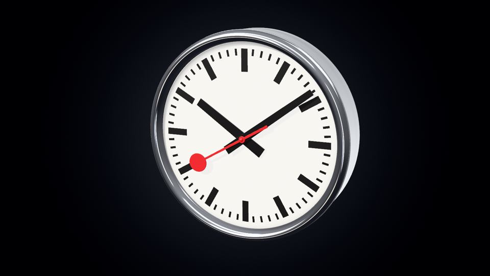 | 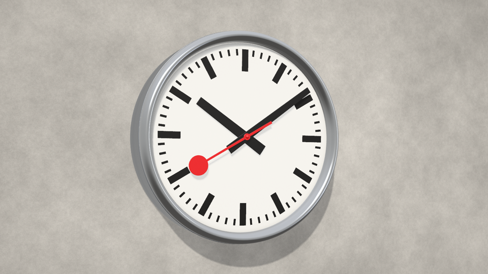 | 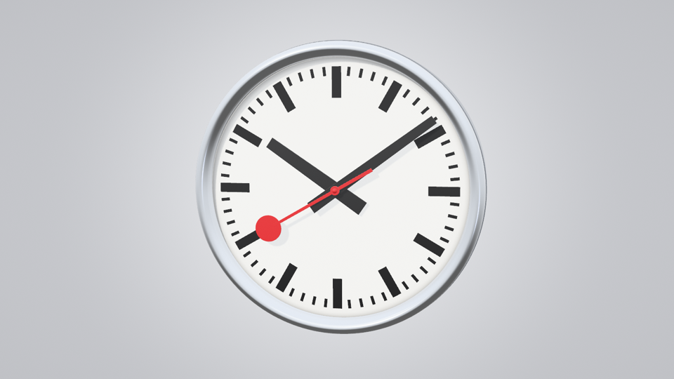 |

| Spring | Summer | Autumn | Winter | Sunset |
|---|---|---|---|---|
| 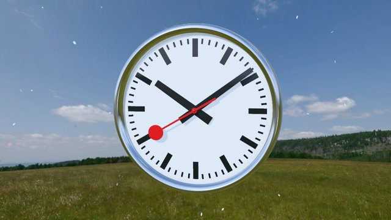 | 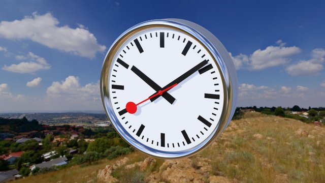 | 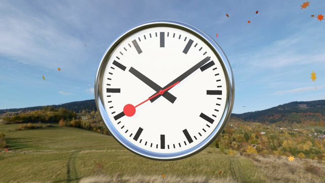 | 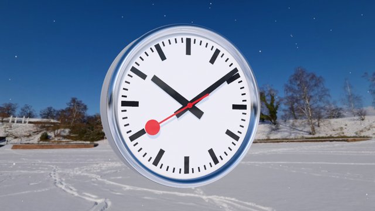 | 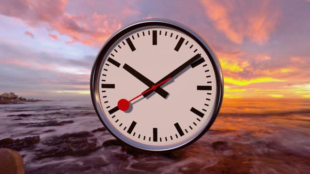 |
| **Rainy day** | **Snowfall** | **Night** | **Railway track** | **Sunflower field** |
| 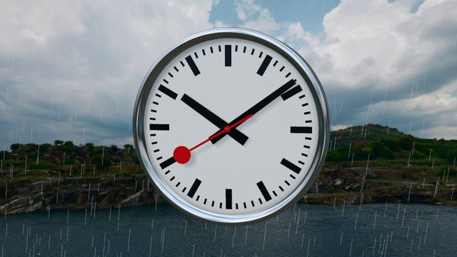 | 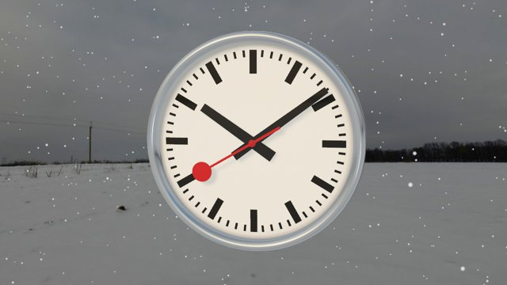 | 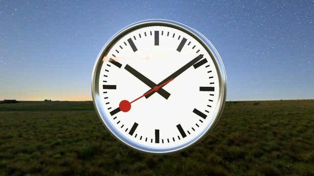 | 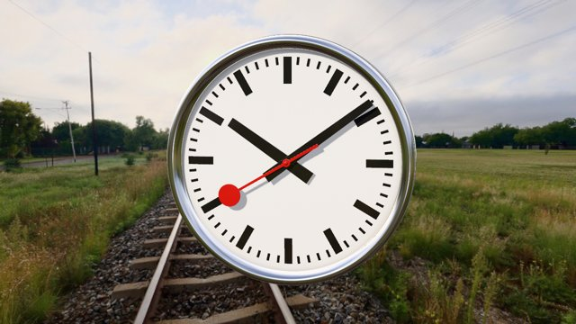 | 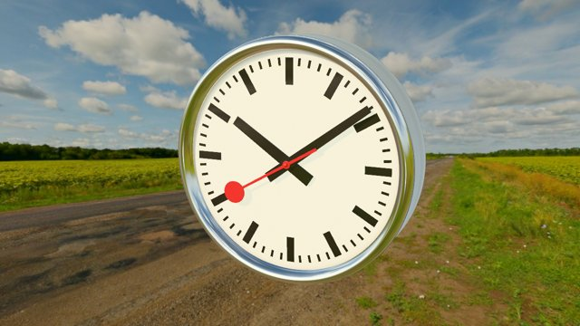 |

| Chrome / nickel · Brushed inox · Aged (rust, mould on a spherical glass) |
|---|
| 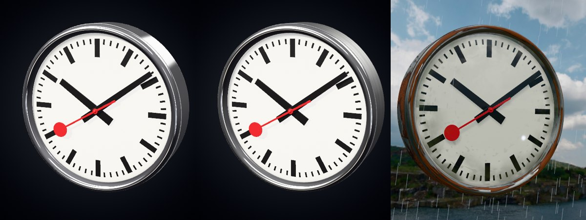 |

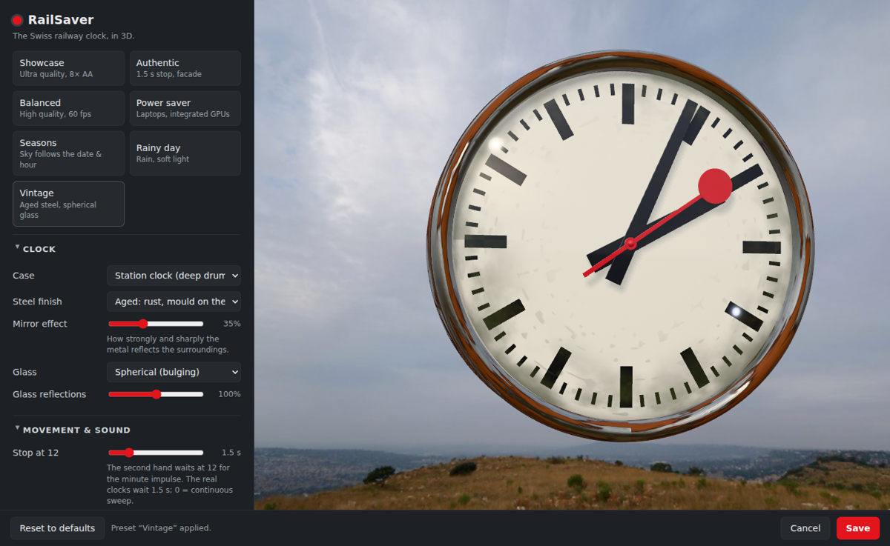

## Install (Windows 10/11)

1. Download `RailSaver-Setup-x.y.z.exe` from the [latest release](https://github.com/vagdesign/RailSaver/releases/latest) (or from the **Actions** tab → latest *Build* run → artifacts).
2. Run it. No administrator rights are needed. Leave **Use RailSaver as my screen saver** ticked.
3. The Windows **Screen Saver Settings** open at the end: pick the wait time, press **Settings…** for RailSaver's own settings, or **Preview**.

Start menu → *RailSaver* also has **RailSaver Settings**, **RailSaver (run now)** and **RailSaver in a window**.

Portable: unzip `RailSaver-portable-…zip` anywhere, right-click `RailSaver.scr` → **Install**.

Requirements: x64, the Microsoft Edge **WebView2 Runtime** (present on almost every PC; without it RailSaver draws a flat 2D clock).

## Install (macOS 11+)

Unzip `RailSaver-mac-x.y.z.zip` and double-click `RailSaver.saver`, then choose it in **System Settings → Screen Saver** and click **Options…** for its settings. It is ad-hoc signed but not notarised. If macOS refuses to open it, run `xattr -dr com.apple.quarantine RailSaver.saver` first.

## Settings

| Group | Settings |
|---|---|
| Clock | Case: *station* (deep drum) or *wall* (slim) · finish: chrome / brushed inox / aged · **mirror effect** · glass: flat / spherical / none · glass reflection strength |
| Movement & sound | **Stop at 12** (0–8 s; default 6 s, the real clocks use 1.5 s, 0 = continuous sweep) · mechanical minute jump · release sound and volume · soft click at 12 · *Play the release sound* button |
| Camera & scene | Background (studio, facade, black, 12 skies incl. automatic seasons) · sky style (photographic / generated) · background focus · weather particles · clock size · **tilt/swing amount** and cycle length · light angle (longer or shorter hand shadows) · brightness · drift |
| Performance | Quality *Low / Medium / High / Ultra* · anti-aliasing · frame rate · render scale · monitors (all / primary only) · battery saver · show FPS |

| Quality | Shadow map | Geometry segments | Reflection map | Resolution |
|---|---|---|---|---|
| Low | 1024 px, soft 2 | 64 | 64 px | 75 %, max 1× DPI |
| Medium | 2048 px, soft 3 | 96 | 128 px | 100 %, max 1.5× DPI |
| High | 2048 px, soft 4 | 160 | 256 px | 100 %, max 2× DPI |
| Ultra | 4096 px, soft 5 | 256 | 256 px | 100 %, max 3× DPI |

Windows stores the settings in `%APPDATA%\RailSaver\settings.json` and the log in `%LOCALAPPDATA%\RailSaver\RailSaver.log`. macOS uses the screen saver defaults (`com.axeasy.RailSaver`).

## How it works

```
web/                       the clock (Three.js / WebGL 2), shared by every platform
 ├─ js/clock.js            procedural model: lathe-turned case & bezel, dial, extruded hands, flat or spherical glass
 ├─ js/finishes.js         chrome, brushed inox and aged steel (rust, glass mould), all textures generated
 ├─ js/stage.js            studio reflection environment, backdrop, concrete wall
 ├─ js/photosky.js         photographic skies: .hdr reader, background lens, HDR reflections, sun alignment
 ├─ js/sky.js              generated skies (clouds, sun, moon, stars), sky presets, automatic seasons
 ├─ js/weather.js          rain, snow, petals and leaves
 ├─ js/motion.js           stop-to-go movement and minute jump (unit-tested: tools/test-motion.mjs)
 ├─ js/audio.js            Web Audio synthesis of the release clack and the latch click
 ├─ js/main.js             renderer, shadows, MSAA target + tone mapping, camera swing, frame cap
 ├─ settings.html, js/ui.js  settings page with live preview
src/RailSaver/             Windows host (C#, WinForms, WebView2): RailSaver.scr
 ├─ /s  one full-screen window per monitor, closes on input (mouse, keys, clicks)
 ├─ /p  small preview in the Screen Saver Settings dialog (GDI+, no WebView)
 └─ /c  the settings page
mac/                       macOS host: RailSaver.saver (ScreenSaverView + WKWebView)
installer/RailSaver.iss    Inno Setup, per-user, sets the active screen saver
```

The model, the brushed-steel texture, the concrete and the sounds are generated in code. The only images are the
photographic skies: `tools/skies.json` lists them, the *Fetch skies* workflow downloads them from Poly Haven onto the
`sky-assets` branch (kept out of the main history because of its ~36 MB), and every build copies them into `web/skies/`.
To change a sky, edit `tools/skies.json` (keys are the themes, values Poly Haven ids) and push.

## Development

Preview in a browser:

```bash
tools/get-skies.sh                   # the photographic skies into web/skies (optional)
npx http-server web -p 8080 -c-1     # open http://localhost:8080/  or  /settings.html
```

Any setting can be put in the URL, plus `time=10:09:36` (show that time), `still` (freeze), `swingPhase=0.25`, `showFps=1`:
`http://localhost:8080/?quality=ultra&background=wall&stopSeconds=1.5`

Headless previews (as in CI): `npm install --no-save playwright && node tools/screenshot.mjs previews "background=wall"`.

Build on Windows (.NET 10 SDK):

```powershell
dotnet publish src/RailSaver/RailSaver.csproj -c Release -r win-x64 --self-contained -o publish
& "${env:ProgramFiles(x86)}\Inno Setup 6\ISCC.exe" /DSourceDir=..\publish installer\RailSaver.iss
publish\RailSaver.exe /w      # run in a window;  /s full screen;  /c settings;  --devtools to inspect
```

Build on macOS: `mac/build.sh 0.1.0` → `out/RailSaver.saver`.

GitHub Actions builds the Windows installer, the portable zip, the macOS bundle and preview renders on every push. Pushes to `main` and `v*` tags publish a release.

## About the design

The Swiss railway clock was designed by **Hans Hilfiker** for the Swiss Federal Railways (SBB) in 1944. The red second hand with the disc, modelled on a station master's signalling disc, was added in 1953. The second hand runs slightly fast, pauses at 12 and is released by the minute impulse from the master clock, so every clock in the network starts the minute together. Further reading: [Swiss National Museum blog](https://blog.nationalmuseum.ch/en/2022/09/the-iconic-swiss-station-clock/), [Red & Company](https://www.redandcompany.com/blog-posts/the-iconic-swiss-train-clock).

RailSaver is a non-commercial fan tribute. It is not affiliated with or endorsed by SBB CFF FFS or Mondaine, and contains no SBB logos or trademarks.

## Credits

Created by **Vangelis Makridakis** ([Ax-Easy](https://www.ax-easy.com)) and **[Claude](https://claude.ai)** (Anthropic). Licence: GPL-3.0 (see [LICENSE](LICENSE)). Third-party components: [THIRD_PARTY_NOTICES.md](THIRD_PARTY_NOTICES.md).
